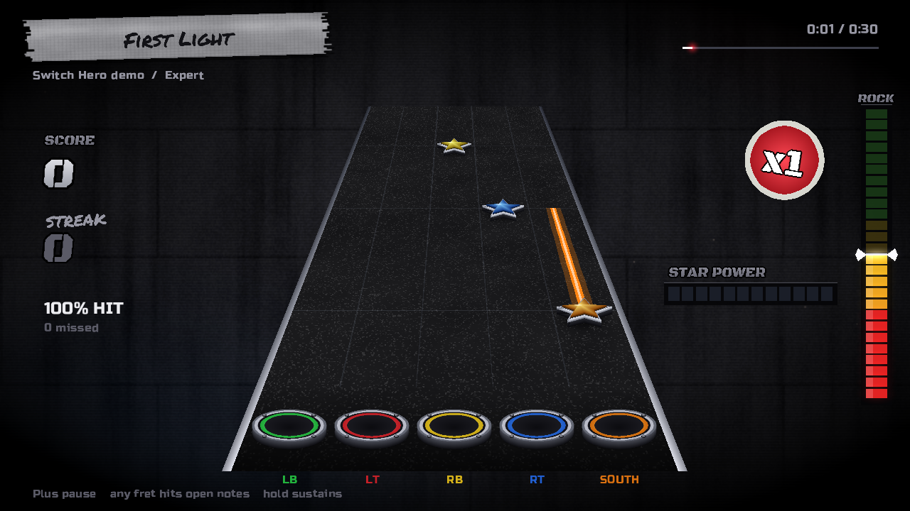

# Switch Hero 0.1

A controller-first, five-fret rhythm-game prototype in C++17/SDL2, targeting
Nintendo Switch homebrew. Loads extracted Clone Hero-style song folders.
It is an independent implementation, not a port of Clone Hero's proprietary source.

**Status:** desktop build and automated gameplay tests pass. The Switch-specific
controller/audio code cross-compiles successfully with devkitPro and produces
`build-switch/switch-hero.nro`. Initial hardware testing found and corrected a
Switch PCM output-format mismatch; the revised audio path still needs a console
retest. Do not treat compilation or the desktop tests as a Switch performance
benchmark.



## Quick desktop build (Ubuntu)

```bash
sudo apt update
sudo apt install build-essential cmake libsdl2-dev libsndfile1-dev python3 ffmpeg
cmake -S . -B build -DCMAKE_BUILD_TYPE=Release
cmake --build build --parallel 4
ctest --test-dir build --output-on-failure
./build/switch-hero --songs ./songs
```

Use libsndfile 1.1 or newer for MP3 support. The included `First Light` song is
an original generated exercise, with a tempo change from 120 to 150 BPM. To
regenerate it:

```bash
python3 tools/make_demo.py songs/First-Light
```

## Switch build

Install the official devkitPro toolchain using its installation documentation:
<https://devkitpro.org/wiki/Getting_Started>.
In an environment with devkitPro's `dkp-pacman` configured, install:

```bash
sudo dkp-pacman -S --needed switch-dev switch-sdl2 switch-libvorbis switch-opusfile switch-mpg123
bash tools/build-switch.sh
```

If your devkitPro environment uses `pacman` directly, use that executable in
place of `dkp-pacman`. The build script expects CMake on PATH and defaults
`DEVKITPRO` to `/opt/devkitpro`. The `switch-dev` group supplies `switch-cmake`.

The intended output is `build-switch/switch-hero.nro`. Once successfully built:

- Put the NRO in `sd:/switch/switch-hero/` (an existing `sd:/switch/fretboard/` still works).
- Put extracted song folders in `sd:/switch/switch-hero/songs/`.
- Launch through your existing homebrew setup with full application memory.
- Settings are stored at `sd:/switch/switch-hero/settings.cfg`.

First hardware gate: boot, play the included demo using both triggers, pause and
resume, and complete the song. Then verify a real imported song with several
audio stems and calibrate audio/input latency. Native linking, GPU output, input
latency, and performance remain unverified until this gate is run.

## Controls

## Song library

Songs are scanned at startup behind a loading screen that counts what it finds,
so a large library no longer sits on a black screen. The scan reads only each
song's title and artist (from `song.ini`, or the chart header when there is no
ini); the chart itself is parsed when you select a song, and problems with a
song are reported then.

Switch Hero reads songs from `sd:/switch/switch-hero/songs`. An existing
`sd:/switch/fretboard/` folder from before the rename is still used when the
new one is absent, so nothing has to be moved.

### Downloading charts

Press **+** on the song list (or **O** on a keyboard) to browse
[Chorus Encore](https://www.enchor.us/), the community Clone Hero chart index.
The screen opens on the newest charts. Only charts with a lead guitar part are
listed.

- **Y** searches by song, artist or charter. The Switch opens its system
  keyboard. On desktop, type the search and press Enter.
- **Up/down** or strum moves through the results. More results load as you
  near the end of the list.
- **A** downloads the selected chart into the songs folder, as
  `Artist - Name (Charter)`.
- **Minus** cancels a download that's running. Otherwise it goes back to the
  song list, which rescans and selects the newest download.

Each row shows the guitar intensity rating (six pips, or `?` when the chart
has no rating), the song length, and **in library** once you have it.

Charts arrive as `.sng` packages. The game unpacks them in a staging folder
and moves them into place only when complete, so a failed or cancelled
download never leaves half a song behind. Background videos are skipped
because the game doesn't play them. The package's metadata becomes `song.ini`.

The Switch needs an internet connection. Networking only starts the first
time you open the download screen. HTTPS uses the console's own SSL service.
Requests identify the game as `switch-hero/0.1`.

## Sound

The game ships no audio files: every interface sound is synthesised in code when
the mixer starts (`buildSfx` in `src/audio.cpp`) — a pick scrape for moving
through the list, a distorted power chord for confirming, drumstick clicks
counting the song in, a dead-string screech when a note is dropped, a riser into
star power, a shimmer for streak milestones, and chords for finishing or
failing a set.

One mixer runs for the whole session. The song plays on its own pausable
channel and effects play on a second channel that is always live, so menus and
the pause screen still make noise. If a second output cannot be opened the song
still plays, just without effects.

## Rock meter

A song is scored against a rock meter that works like a tug of war, as in the
games it takes after: every note hit pulls the needle one step toward green,
while a missed note or a strum at nothing drags it three steps toward red, so a
sloppy run drains it far faster than a clean one rebuilds it. Star power pulls
twice as hard per note, the emergency rescue for a section that keeps beating
you. Deep in the red the meter flashes, the screen pulses red, and the guitar
stem drops out of the mix, leaving the rest of the band playing; the stem
returns when you recover. If the meter empties the song ends in failure.

Songs that ship a single mixed audio file keep playing normally in the red,
since there is no separate guitar to mute. There is no crowd or band
animation, so there are no boos to hear.

Turn the meter off with **No-fail mode** in settings, or with X (N on a
keyboard, blue fret on a Wii guitar) in the song list; the song list shows
which mode is armed.

## Icon

`icon.jpg` (256x256) is the NRO icon shown in hbmenu, supplied by the project
owner. It borrows Guitar Hero-style lettering and Switch hardware, so it is
fine for a personal build but should not go on a public release.

## Look

Switch Hero has its own art direction: a 2000s older-brother bedroom, all burned
CD-Rs and Sharpie, duct tape, skate grip tape, spray-paint stencil lettering,
chrome and a CRT glow. Every texture is generated in code at startup (grip
tape, tape strips, brushed metal, the wall, gems, fret buttons and fire), so
the only art files are three fonts in `assets/fonts`, embedded in the Switch
NRO's RomFS and loaded from the working directory on desktop. A song's own
`album.jpg`/`album.png` (or `cover.*`) is shown beside the disc in the song
list, decoded with the vendored public-domain `stb_image.h`:

| Font | Use | License |
|---|---|---|
| Black Ops One | stencil headings, score | SIL Open Font License 1.1 |
| Permanent Marker | Sharpie handwriting | Apache License 2.0 |
| Russo One | body text | SIL Open Font License 1.1 |

The frame is finished with a single grade pass — vignette, CRT scanlines and a
tiling film grain — drawn by `look::grade()` **after everything else**, once, just
before the frame is presented. This matters more than it sounds: the same three
layers used to be blitted as part of the wall, which put them *behind* the
highway, the gems and the HUD, so every layer carried its own lighting and the
image read as pasted-together parts rather than one photograph. Anything added
to a screen has to draw before the grade to sit under it.

Gems cast a contact shadow on the board, a held fret spills its colour back up
the lane, and the far end of the highway is hazed over so notes resolve out of
the dark instead of appearing on a hard edge. The gameplay read-outs are bolted
to a brushed-metal faceplate with engraved rules rather than floating on the
wall.

`tools/make_fonts.py` re-bakes the `.font` atlases from the TTFs (needs
Pillow). The highway scrolls on a perspective-matched plane and both drawing
and hit judgement run off a frame-timed clock eased toward the audio clock, so
motion stays smooth between audio updates. Console frame pacing still needs
hardware testing.

The board is deliberately only lightly foreshortened, and the default lookahead
is 1.2 seconds. A harder taper or a longer lookahead crushes most of the chart
into the top of the highway, where a fast run collapses into a blob before it
can be counted; in the far band notes are additionally held at least half a gem
apart so dense passages stay readable. Near the fret buttons real spacing is
already wider than that floor, so it never moves the notes being played.

Default Switch layout uses shoulders/triggers so chords can be played without
trying to press several face buttons with one thumb.

| Action | Switch | Desktop keyboard |
|---|---|---|
| Green / red / yellow / blue / orange | L / ZL / R / ZR / B | A / S / D / F / G |
| Open note (press-to-hit) | Any fret, or A | Any fret, or Space |
| Toggle no-fail from the song list | X | N |
| Strum, if enabled | D-pad up/down | Up/down or Space |
| Star power | X | Left Shift |
| Pause / resume | Plus | P |
| Menu confirm / resume | A | Enter |
| Back / exit song | Minus | Escape |
| Settings from song list | Y | Tab |
| Restart while paused / at results | Y | R |
| Choose song | D-pad up/down | Up/down |
| Choose instrument/difficulty | L/R or D-pad left/right | Left/right |

On desktop gamepads, directions refer to physical button positions:
south = Switch B / Xbox A; east = Switch A / Xbox B; west = Switch Y / Xbox X;
north = Switch X / Xbox Y. Analog trigger threshold is roughly half travel.

Default **press-to-hit** mode needs a fresh press for each note; notes never
auto-play from holding a button.

- **Single notes** are forgiving: the note's fret has to go down, and a fret
  still held from the previous note in a fast run does not spoil the hit.
- **Chords** must be fretted exactly. An extra fret is a wrong chord, not a
  sloppy right one. Any change that lands on the exact shape counts, so a
  repeated chord can be re-struck by re-pressing one fret while the others stay
  down, and a stray finger can be lifted to correct the chord.
- **Open notes** take any fret, or the dedicated open button.
- Frets held down by an ongoing extended sustain are not part of the shape and
  never count against a chord.
- Two notes pressed within the same frame both count.
- A press takes the note it fits that is **nearest in time**, not the earliest one
  still inside the window. In a fast run a dropped note would otherwise swallow
  the next press and leave every press after it landing a note behind.

Hits are graded on timing: **perfect** within 25 ms, **great** within 45 ms, and
**good** out to the 70 ms edge of the window, worth 1.35x, 1.15x and 1x of the
note's score. The grade is called above the fret buttons, and anything short of
perfect also shows whether you were early or late. The results screen breaks the
run down by grade, so accuracy and cleanliness read separately.

Wii guitar mode needs the patched MissionControl module from
`integrations/missioncontrol/` — without it the guitar never reaches the game.
Guitar mode only isolates player one while a controller is connected there, Plus
and Minus always answer from the normal controller, and holding Minus for two
seconds returns to the song list, so guitar mode cannot leave the game without
input. **Settings -> Controller test** shows live input for diagnosing a guitar.

Strum mode (used by Wii guitars) supports HOPO/tap transitions and lower-fret
anchoring for single notes, with the leniency real guitar games have: a strum
just before its note still counts, a strum only costs you once it has had its
chance to land, and strumming a hammer-on you already played is swallowed
rather than punished. Hammer-ons show a white-hot core, and star-power notes
are star-shaped — with the same white core when they are hammer-ons. Judgement and scoring are this prototype's rules, not a promise of
exact Clone Hero score parity.

Settings include controller fret remapping, press-to-hit/strum mode, audio/input
offset, visual offset, and highway travel speed. Start with offsets at zero;
positive audio/input offset schedules judgement later relative to audio.

To calibrate, select either offset and press A (green on a Wii guitar):

1. **Audio / input offset:** a click track plays through the song channel,
   so it has the same latency as the music. Tap any fret or strum on every
   click for 12 taps. The median error becomes the offset.
2. **Visual offset:** calibrate audio first. The clicks go silent and notes
   scroll down the highway. Tap as each note crosses the line. The median
   error corrects the visual offset.

The result screen shows the old and new values and warns you if your taps
were uneven. Press A to keep the new value, Y to retry, or minus to cancel.
Left/right still fine-tunes either offset in 5 ms steps.

## Wii guitar over Bluetooth (Switch)

Select **WII GUITAR** in Settings → Controller mode. This uses fixed five-fret
bindings, strum judgement, guitar menu shortcuts, and Minus for star power.
Bluetooth requires the supplied **MissionControl guitar-extension patch**;
installing the game NRO alone or using stock MissionControl is insufficient.
See [build, pairing, controls, and hardware-test instructions](integrations/missioncontrol/README.md).
Tilt, whammy effects, and touch-strip inputs are not implemented.

## Importing Clone Hero songs

Copy an **extracted song directory**, without editing the chart:

```text
songs/
  Artist - Song/
    song.ini
    notes.chart          (or notes.mid)
    song.ogg             (or song.opus / song.mp3 / guitar.ogg, etc.)
    guitar.ogg           (optional separate stem)
    drums_1.ogg          (optional separate stem)
```

Subdirectories are scanned recursively, to a maximum depth of 16. Standard
file names are recognized case-insensitively. When both `notes.mid` and
`notes.chart` exist, **MIDI takes precedence**. Arbitrary chart filenames must
be renamed to `notes.chart` before import.

Audit parsing and detected stems:

```bash
./build/switch-hero --songs /path/to/song-library --inspect
```

This command reports metadata, tracks, note counts, offsets, and parsing
warnings. It returns failure if any discovered song fails to parse. It does not
decode audio; launching a song checks its audio decoder.

Check timing while playing:

```bash
./build/switch-hero --timing
```

This shows frame time, how far the song clock sits from the audio (drift), and
the clock's running speed (rate). Healthy playback keeps drift within a few ms
and rate within 1 ± 0.01.

### Compatibility boundary

| Feature | Status |
|---|---|
| `notes.chart`, `song.ini` | Implemented; UTF-8 BOM and UTF-16 BOM supported |
| `notes.mid` | PPQN format 0/1, running status, tempo map, note-on/off |
| Five-fret Guitar/Bass/Rhythm/Co-op/Keys | Implemented, Easy through Expert when charted |
| Tempo changes, offsets | Implemented; `song.ini delay` takes precedence over `.chart Offset` |
| Chords, open notes, disjoint/extended sustains | Implemented |
| Natural and forced HOPOs, tap notes | Parsed; used by optional strum mode |
| MIDI enhanced opens and Phase Shift open/tap SysEx | Implemented, including inclusive tap-end behavior |
| Star-power phrases | Implemented, including MIDI 103/116 selection |
| OGG Vorbis, Opus, MP3 | Desktop tested; Switch decoder implementations await hardware/build verification |
| Separate stems | Synchronized streaming mix; numbered drums/vocals replace corresponding combined stems |
| WAV | Desktop tested; Switch implementation supports mono/stereo PCM16 and float32 |
| FLAC | Desktop only; convert to OGG before Switch use |
| Video/background art, lyrics, solos/BRE special scoring | Not implemented; gameplay still reads regular notes |
| `.sng`, ZIP, RAR archives | Not opened directly; extract to a song folder first |
| Six-fret guitars, drums, vocals, pro instruments | Not playable in this version |
| Multiplayer, practice speed, saved highscores | Not implemented |
| Exact Clone Hero engine/score parity | Not claimed |

Audio is mixed at 48 kHz stereo in a worker thread with a bounded queue and
small per-stem decode buffers. Mono/stereo stems at 8–192 kHz are resampled.
The desktop decoder is libsndfile; Switch uses libvorbisfile, libopusfile,
mpg123, and a small WAV reader. Streams are not preloaded in full. Song time
comes from consumed audio samples, with a configurable latency correction;
the exact hardware-output latency still requires calibration.

## Tests

`ctest` generates independent synthetic .chart/MIDI fixtures and codec audio
fixtures using ffmpeg. Tests cover tempo changes, chart/MIDI equivalence,
offset precedence, note modifiers, SysEx boundaries, malformed input,
stem selection, controller-mode hit rules, extended sustains, star power,
audio decoding, and playback clock/pause/restart behavior.

A real SDL virtual-controller integration test (desktop) exercises shoulders,
triggers and a face button through the normal controller input path:

```bash
SDL_VIDEODRIVER=dummy SDL_AUDIODRIVER=dummy \
  ./build/switch-hero --songs ./songs --smoke --screenshot preview.bmp
```

It fails if fewer than two notes are hit or playback is interrupted. The smoke
test uses default bindings and does not save its settings. The dummy audio
driver proves software integration, not physical sound/output latency.

## Source map

- `src/song.cpp`: chart/MIDI parsing, metadata, tempo conversions, stem discovery.
- `include/game.hpp`: timing judgement, sustained notes, combo and star power.
- `src/audio.cpp`: streaming decoders, mixing, queue and audio clock.
- `src/main.cpp`: screens, highway layout, menus, controller mapping, Switch libnx input.
- `src/look.cpp`: fonts, procedural textures, gems, fret buttons, fire, UI pieces.
- `tools/make_fonts.py`: bakes `assets/fonts/*.font` atlases from the bundled TTFs.
- `tests/`: generated fixtures and parser/gameplay/audio tests.
- `tools/build-switch.sh`: devkitPro CMake/NRO build.

## References and licenses

The implementation follows publicly documented formats; no Clone Hero or
Guitar Hero game code, graphics, or music is included.

- Format reference: <https://github.com/TheNathannator/GuitarGame_ChartFormats>
- SDL: <https://github.com/libsdl-org/SDL>
- libnx: <https://github.com/switchbrew/libnx>
- devkitPro portlibs/build definitions: <https://github.com/devkitPro/pacman-packages>
- libsndfile: <https://github.com/libsndfile/libsndfile>
- Bitmap font: <https://github.com/dhepper/font8x8>, public domain. The bundled
  header changes its array element type to `unsigned char` for C++ narrowing rules.

Project source: MIT. Dependencies retain their own licenses; their source and
libraries are not bundled in this source archive. See the font header for its
public-domain attribution.
