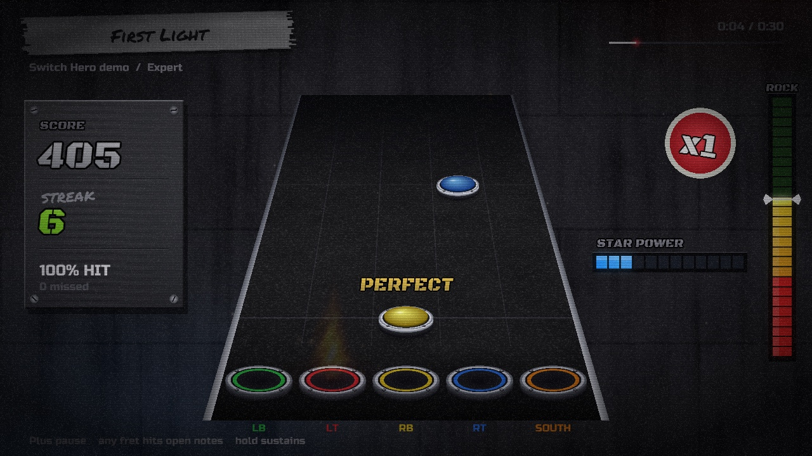
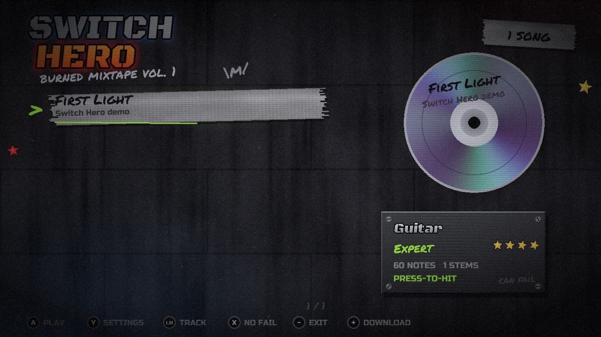
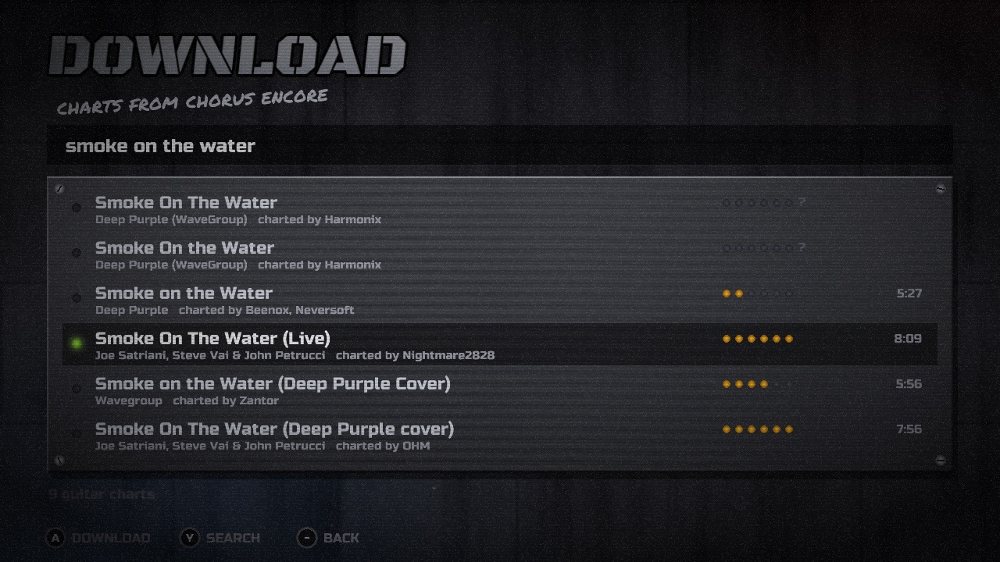
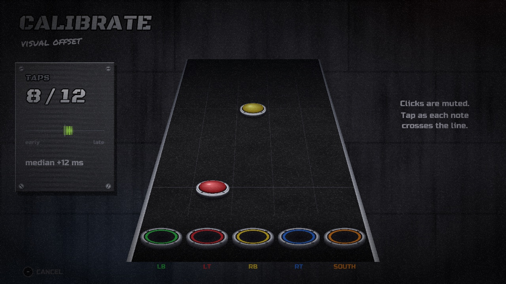

# Switch Hero 0.1

A five-fret rhythm game for Nintendo Switch homebrew, written in C++17 and SDL2.
It plays Clone Hero-style song folders, downloads charts from
[Chorus Encore](https://www.enchor.us/) in-game, and works with Joy-Cons, a Pro
Controller or a Wii guitar. It is an independent implementation, not a port of
Clone Hero's proprietary source.



| Song list | Chart downloads | Offset calibration |
|---|---|---|
|  |  |  |

**Status:** the desktop build and all automated tests pass, and the Switch build
cross-compiles with devkitPro into `build-switch/switch-hero.nro`. Early console
tests confirmed startup and song discovery. The latest build still needs a full
run on hardware, covering audio, smooth scrolling, calibration and chart
downloads. Don't treat the desktop tests as a Switch performance benchmark.

## Install on a Switch

The ready-to-copy build is in [`release/`](release/). Copy `release/switch-hero`
into the `switch` folder at the root of the SD card:

```text
sd:/switch/switch-hero/
  switch-hero.nro
  songs/First-Light/     (demo song)
```

Launch it from the Homebrew Menu. Hold R while starting any game to open the
Homebrew Menu with full memory. That's recommended for big songs and needed if
the download keyboard won't open. Settings are saved to
`sd:/switch/switch-hero/settings.cfg`. [`release/INSTALL.txt`](release/INSTALL.txt)
has the same steps for the SD card.

Coming from the prototype when it was called Fretboard? Move your songs and
`settings.cfg` from `sd:/switch/fretboard/` to `sd:/switch/switch-hero/`, then
delete the old folder so the Homebrew Menu only lists Switch Hero.

## Features

- **Smooth, steady scrolling.** The song clock runs on the real-time timer and
  slowly leans towards the audio's average position, changing speed by at most
  1% (the approach YARG uses). Notes don't wobble with the audio backend's
  buffer steps. Each note sits exactly where the highway's perspective puts it,
  and notes fade in from the far end of the board.
- **Timing grades.** **Perfect** within 25 ms, **great** within 45 ms and
  **good** out to the 70 ms edge of the window, worth 1.35x, 1.15x and 1x. On
  desktop, presses are judged at their input timestamps rather than at the
  frame that reads them.
- **Offset calibration.** Tap along to set the audio and visual offsets (see
  [Calibration](#calibration)).
- **In-game chart downloads** from Chorus Encore (see
  [Downloading charts](#downloading-charts)).
- **Rock meter, star power and no-fail mode.** A miss drains the meter three
  times as fast as a hit refills it. Star power pulls it back twice as hard.
- **Three controller modes:** press-to-hit for Joy-Cons and Pro Controllers,
  strum, and Wii guitar over Bluetooth.
- **Its own look.** A 2000s bedroom full of burned CD-Rs, duct tape and grip
  tape, with every texture generated in code (see [Look](#look)).

## Controls

The default Switch layout uses the shoulders and triggers, so chords don't need
several face buttons under one thumb.

| Action | Switch | Desktop keyboard |
|---|---|---|
| Green / red / yellow / blue / orange | L / ZL / R / ZR / B | A / S / D / F / G |
| Open note (press-to-hit) | Any fret, or A | Any fret, or Space |
| Strum, if enabled | D-pad up/down | Up/down or Space |
| Star power | X | Left Shift |
| Pause / resume | Plus | P |
| Choose song | D-pad up/down | Up/down |
| Choose instrument/difficulty | L/R or D-pad left/right | Left/right |
| Play / confirm | A | Enter |
| Settings from the song list | Y | Tab |
| Download charts from the song list | Plus | O |
| Toggle no-fail from the song list | X | N |
| Restart while paused / at results | Y | R |
| Back / exit song | Minus | Escape |

Holding Minus for two seconds returns to the song list from any screen.

On desktop gamepads, directions refer to physical button positions:
south = Switch B / Xbox A; east = Switch A / Xbox B; west = Switch Y / Xbox X;
north = Switch X / Xbox Y. Analog triggers count as pressed at about half travel.

### Press-to-hit mode

The default mode needs a fresh press for each note. Notes never play
themselves while a button is held.

- **Single notes** are forgiving: the note's fret has to go down, and a fret
  still held from the previous note in a fast run doesn't spoil the hit.
- **Chords** must be fretted exactly. An extra fret makes a wrong chord, not a
  sloppy right one. Any change that lands on the exact shape counts, so a
  repeated chord can be re-struck by re-pressing one fret while the others stay
  down, and a stray finger can be lifted to fix the chord.
- **Open notes** take any fret, or the dedicated open button.
- Frets held down by an ongoing extended sustain aren't part of the shape and
  never count against a chord.
- Two notes pressed within the same frame both count.
- A press takes the note it fits that is **nearest in time**, not the earliest
  one still inside the window. Otherwise, in a fast run, a dropped note would
  swallow the next press, and every press after it would land a note behind.

### Strum mode

Strum mode, which Wii guitars use, supports HOPO and tap transitions, and lower-fret
anchoring for single notes. It has the leniency real guitar games have:
- A strum just before its note still counts.
- A stray strum only costs you once it has had its chance to land.
- Strumming a hammer-on you already played is ignored rather than punished.

Hammer-ons show a white-hot core. Star-power notes are star-shaped, with the
same core when they're hammer-ons. Judgement and scoring are this game's own
rules, not a promise of exact Clone Hero score parity.

### Wii guitar over Bluetooth

Select **WII GUITAR** in Settings → Controller mode. This uses fixed five-fret
bindings, strum judgement, guitar menu shortcuts, and Minus for star power.
Bluetooth needs the supplied **MissionControl guitar-extension patch** from
[`integrations/missioncontrol/`](integrations/missioncontrol/README.md).
Installing the game alone, or using stock MissionControl, isn't enough.

Guitar mode only takes over player one while a controller is connected there.
Plus and Minus always respond from the normal controller, so guitar mode can't
lock you out of the game. **Settings → Controller test** shows live input for
diagnosing a guitar. Tilt, whammy effects and touch-strip inputs aren't
implemented.

## Calibration

Settings has an **audio / input offset** and a **visual offset**. Select
either one and press A (green on a Wii guitar) to calibrate by tapping along:

1. **Audio / input offset:** a click track plays through the song channel, so
   it has the same latency as the music. Tap any fret or strum on every click
   for 12 taps. Nothing on screen moves with the beat, so only your ears set
   the timing.
2. **Visual offset:** do the audio offset first. The clicks go silent and notes
   scroll down the highway. Tap as each note crosses the line.

Each tap is scored against the nearest beat, and the median error becomes the
offset. The median means one fumbled tap can't throw it off. The result screen
shows the old and new values and warns you when your taps were uneven. A keeps
the new value, Y retries, and Minus cancels. Left/right still fine-tunes either
offset in 5 ms steps. A positive audio offset judges notes later.

## Song library

Switch Hero reads songs from `sd:/switch/switch-hero/songs` (on desktop,
`./songs` or `--songs FOLDER`). At startup a loading screen counts the songs as
it finds them. The scan reads only each song's title and artist; the chart is
parsed when you select the song, and any problems are reported then.

### Downloading charts

Press **Plus** on the song list (or **O** on a keyboard) to browse Chorus
Encore, the community Clone Hero chart index. The screen opens on the newest
charts. Only charts with a lead guitar part are listed.

- **Y** searches by song, artist or charter. The Switch opens its system
  keyboard. On desktop, type the search and press Enter.
- **Up/down** or strum moves through the results. More results load as you
  near the end of the list.
- **A** downloads the selected chart into the songs folder, as
  `Artist - Name (Charter)`.
- **Minus** cancels a download that's running. Otherwise it goes back to the
  song list, which rescans and selects the newest download.

Each row shows the guitar intensity rating (six pips, or `?` when the chart
has no rating), the song length, and **in library** once you have it.

Charts arrive as `.sng` packages. The game unpacks them in a staging folder and
moves them into place only when complete, so a failed or cancelled download
never leaves half a song behind. Background videos are skipped, because the
game doesn't play them. The package's metadata becomes `song.ini`.

The Switch needs an internet connection. Networking only starts the first time
you open the download screen. HTTPS uses the console's own SSL service.
Requests identify the game as `switch-hero/0.1`.

### Copying songs yourself

Copy an **extracted song folder** without editing the chart:

```text
songs/
  Artist - Song/
    song.ini
    notes.chart          (or notes.mid)
    song.ogg             (or song.opus / song.mp3 / guitar.ogg, etc.)
    guitar.ogg           (optional separate stem)
    drums_1.ogg          (optional separate stem)
```

Subfolders are scanned recursively, up to 16 levels deep. Standard file names
are recognized case-insensitively. When both `notes.mid` and `notes.chart`
exist, **MIDI takes precedence**. Other chart file names must be renamed to
`notes.chart`.

Check a library's parsing and detected stems:

```bash
./build/switch-hero --songs /path/to/song-library --inspect
```

This reports metadata, tracks, note counts, offsets and parsing warnings, and
fails if any song fails to parse. It doesn't decode audio; launching a song
checks its audio.

### Compatibility

| Feature | Status |
|---|---|
| `notes.chart`, `song.ini` | Implemented; UTF-8 BOM and UTF-16 BOM supported |
| `notes.mid` | PPQN format 0/1, running status, tempo map, note-on/off |
| Five-fret Guitar/Bass/Rhythm/Co-op/Keys | Implemented, Easy through Expert when charted |
| Tempo changes, offsets | Implemented; `song.ini delay` takes precedence over `.chart Offset` |
| Chords, open notes, disjoint/extended sustains | Implemented |
| Natural and forced HOPOs, tap notes | Parsed; used by strum mode |
| MIDI enhanced opens and Phase Shift open/tap SysEx | Implemented, including inclusive tap-end behavior |
| Star-power phrases | Implemented, including MIDI 103/116 selection |
| OGG Vorbis, Opus, MP3 | Desktop tested; Switch decoders built in, awaiting a full hardware run |
| Separate stems | Synchronized streaming mix; numbered drums/vocals replace corresponding combined stems |
| WAV | Desktop tested; Switch supports mono/stereo PCM16 and float32 |
| FLAC | Desktop only; convert to OGG before Switch use |
| `.sng` packages | Unpacked by the in-game downloader; copied `.sng` files aren't opened directly |
| ZIP, RAR archives | Not opened; extract to a song folder first |
| Accented titles | Shown without accents (the fonts are ASCII); other scripts show as `?` |
| Video/background art, lyrics, solos/BRE special scoring | Not implemented; gameplay still reads regular notes |
| Six-fret guitars, drums, vocals, pro instruments | Not playable in this version |
| Multiplayer, practice speed, saved high scores | Not implemented |
| Exact Clone Hero engine/score parity | Not claimed |

## Sound

Audio is mixed at 48 kHz stereo on a worker thread, with a bounded queue and
small per-stem decode buffers. Mono and stereo stems at 8–192 kHz are
resampled, and streams are never loaded in full. The desktop decoder is
libsndfile. The Switch uses libvorbisfile, libopusfile, mpg123 and a small WAV
reader. Minor damage in a stem, such as an Ogg page with bad timestamps, is
skipped rather than stopping the song.

The game ships no sound-effect files: every interface sound is synthesised in
code when the mixer starts (`buildSfx` in `src/audio.cpp`):
- a pick scrape for moving through the list
- a distorted power chord for confirming
- drumstick clicks counting the song in
- a dead-string screech when a note is dropped
- a riser into star power
- a shimmer for streak milestones
- chords for finishing or failing a set

One mixer runs for the whole session. The song plays on its own pausable
channel, and effects play on a second channel that is always live, so menus and
the pause screen still make noise. If a second output can't be opened, the song
still plays, just without effects.

## Rock meter

A song is scored against a rock meter that works like a tug of war. Every note
hit pulls the needle one step toward green, while a missed note or a strum at
nothing drags it three steps toward red. Star power pulls twice as hard per
note. Deep in the red the meter flashes, the screen pulses red, and the guitar
stem drops out of the mix while the rest of the band keeps playing. The stem
comes back when you recover. If the meter empties, the song ends in failure.
Songs with a single mixed audio file keep playing normally in the red, since
there's no separate guitar to mute.

Turn the meter off with **No-fail mode** in Settings, or with X (N on a
keyboard, blue fret on a Wii guitar) in the song list. The song list shows
which mode is set.

## Look

Switch Hero has its own art direction: a 2000s older-brother bedroom, all burned
CD-Rs and Sharpie, duct tape, skate grip tape, spray-paint stencil lettering,
chrome and a CRT glow. Every texture is generated in code at startup: grip
tape, tape strips, brushed metal, the wall, gems, fret buttons and fire. The
only art files are three fonts in `assets/fonts`. They're embedded in the
Switch NRO's RomFS, and loaded from the working directory on desktop. A song's
own `album.jpg`/`album.png` (or `cover.*`) is shown beside the disc in the song
list, decoded with the vendored public-domain `stb_image.h`.

| Font | Use | License |
|---|---|---|
| Black Ops One | stencil headings, score | SIL Open Font License 1.1 |
| Permanent Marker | Sharpie handwriting | Apache License 2.0 |
| Russo One | body text | SIL Open Font License 1.1 |

The frame is finished with a single grade pass (vignette, CRT scanlines and a
tiling film grain), drawn by `look::grade()` **after everything else**, once,
just before the frame is presented. That way the highway, gems and HUD share one
light instead of each carrying its own, and the image reads as one photograph
rather than pasted-together parts. Anything added to a screen has to draw before
the grade to sit under it.

Gems cast a contact shadow on the board, a held fret spills its colour back up
the lane, and the far end of the highway is hazed over, with notes fading in as
they leave it. The gameplay read-outs are bolted to a brushed-metal faceplate
with engraved rules, and a long score shrinks to fit it.

The board is only lightly foreshortened, and the default lookahead is 1.2
seconds. A harder taper or a longer lookahead crushes most of the chart into the
top of the highway. If fast runs are hard to read, shorten **Highway travel**
in Settings.

`tools/make_fonts.py` re-bakes the `.font` atlases from the TTFs (needs Pillow).

## Icon

`icon.jpg` (256x256) is the NRO icon shown in the Homebrew Menu, supplied by the
project owner.

## Building

### Desktop (Ubuntu)

```bash
sudo apt update
sudo apt install build-essential cmake libsdl2-dev libsndfile1-dev libcurl4-openssl-dev python3 ffmpeg
cmake -S . -B build -DCMAKE_BUILD_TYPE=Release
cmake --build build --parallel 4
ctest --test-dir build --output-on-failure
./build/switch-hero --songs ./songs
```

Use libsndfile 1.1 or newer for MP3 support. The included `First Light` song is
an original generated exercise, with a tempo change from 120 to 150 BPM. To
regenerate it:

```bash
python3 tools/make_demo.py songs/First-Light
```

`--timing` shows frame time, how far the song clock sits from the audio
(drift), and the clock's running speed (rate) while playing. Healthy playback
keeps drift within a few ms and rate within 1 ± 0.01.

### Switch

Install the official devkitPro toolchain following
<https://devkitpro.org/wiki/Getting_Started>. With `dkp-pacman` configured:

```bash
sudo dkp-pacman -S --needed switch-dev switch-sdl2 switch-libvorbis switch-opusfile switch-mpg123 switch-curl
bash tools/build-switch.sh
```

If your devkitPro setup uses `pacman` directly, use that in place of
`dkp-pacman`. The build script expects CMake on PATH and defaults `DEVKITPRO` to
`/opt/devkitpro`. The `switch-dev` group supplies `switch-cmake`. Without a local
toolchain, build in Docker:

```bash
docker run --rm -v "$PWD:/work" -w /work devkitpro/devkita64:latest \
  bash -lc 'bash tools/build-switch.sh'
```

The output is `build-switch/switch-hero.nro`. Copy it over
`release/switch-hero/switch-hero.nro` to refresh the release.

First hardware check:
1. Boot the game and play the demo song with both triggers.
2. Pause, resume and finish the song.
3. Play a downloaded song with several audio stems.
4. Calibrate both offsets.
5. Play a dense chart with steady scrolling.

## Tests

`ctest` runs:

- **core**: tempo changes, chart/MIDI equivalence, offset precedence, note
  modifiers, SysEx boundaries, malformed input, stem selection, hit rules,
  extended sustains, star power and the rock meter. Its fixtures are generated
  by `tests/make_fixtures.py`, which needs ffmpeg built with libvorbis.
- **audio**: WAV, OGG, Opus, MP3 and FLAC decoding, plus playback, pause and restart.
- **timing**: the song clock against a stepped audio clock (speed, settling,
  jumps, never running backwards), press timestamps, and tap calibration.
- **enchor**: search requests and responses, folder names, and `.sng`
  unpacking, including path traversal, truncated and bogus packages.
- **guitar**: Wii guitar input routing.

A real SDL virtual-controller test plays the demo through the normal input path:

```bash
SDL_VIDEODRIVER=dummy SDL_AUDIODRIVER=dummy \
  ./build/switch-hero --songs ./songs --smoke --screenshot preview.bmp
```

It fails if fewer than two notes are hit or playback is interrupted. It uses
default bindings and doesn't save its settings. The dummy audio driver proves
the software works together, not physical sound or output latency.

## Source map

- `src/song.cpp`: chart/MIDI parsing, metadata, tempo conversions, stem discovery.
- `include/game.hpp`: timing judgement, sustains, combo, star power and rock meter.
- `include/clock.hpp`: the song clock.
- `include/calibration.hpp`: tap-along offset calibration.
- `src/audio.cpp`: streaming decoders, mixing, sound effects and the calibration click track.
- `src/enchor.cpp`: Chorus Encore requests and responses, and `.sng` unpacking.
- `src/downloader.cpp`: the background download thread (curl; libnx sockets on Switch).
- `src/main.cpp`: screens, highway layout, menus, controller mapping, Switch libnx input.
- `src/look.cpp`: fonts, procedural textures, gems, fret buttons, fire, UI pieces.
- `include/guitar_input.hpp`, `integrations/missioncontrol/`: Wii guitar support.
- `tools/make_fonts.py`: bakes `assets/fonts/*.font` atlases from the bundled TTFs.
- `tools/build-switch.sh`: devkitPro CMake/NRO build.
- `tests/`: fixtures and parser, gameplay, audio, timing and download tests.
- `release/`: the ready-to-copy Switch build and install instructions.

## References and licenses

The implementation follows publicly documented formats. No Clone Hero or Guitar
Hero game code, graphics or music is included.

- Chart formats: <https://github.com/TheNathannator/GuitarGame_ChartFormats>
- `.sng` format: <https://github.com/mdsitton/SngFileFormat>
- Chorus Encore: <https://www.enchor.us/>. The download endpoints match its
  official client, [Bridge](https://github.com/Geomitron/Bridge). No Bridge code
  is used.
- Timing model inspired by [YARG](https://github.com/YARC-Official/YARG)
- SDL: <https://github.com/libsdl-org/SDL>
- libnx: <https://github.com/switchbrew/libnx>
- devkitPro portlibs/build definitions: <https://github.com/devkitPro/pacman-packages>
- libsndfile: <https://github.com/libsndfile/libsndfile>
- curl: <https://curl.se/> (curl license)
- nlohmann/json 3.11.3, vendored as `vendor/json.hpp`: MIT
- stb_image, vendored as `vendor/stb_image.h`: public domain / MIT

Project source: MIT. Dependencies keep their own licenses. Fonts are covered
by the licenses in `assets/fonts`.
